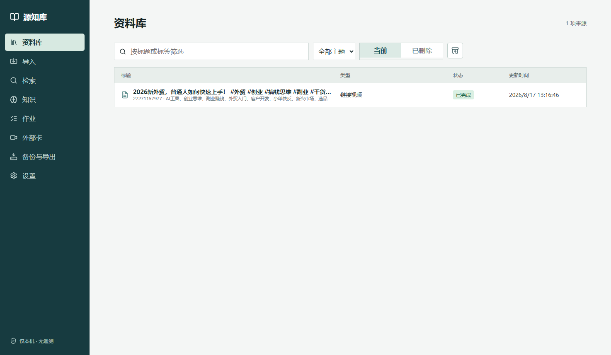
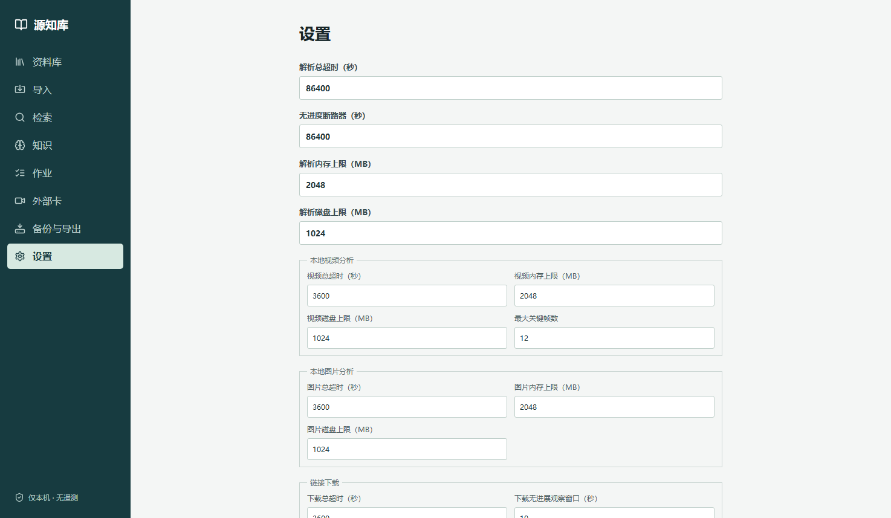

# 源知库 YuanZhiKu

> 本地优先的单用户证据知识库：来源经不可变哈希校验的证据链沉淀为可引用知识，仅绑定本机回环、零遥测、无静默出站。


**源知库**把"看过、读过、下载过的资料"变成**可引用的证据知识**：每一份导入的来源都会生成不可变的内容寻址副本，解析/转写/摘要产出的每一条结论都携带可回溯定位的证据，最终沉淀为你自己的、可检索、可引用的知识条目——全过程只发生在你自己的电脑上。

| 库页面 | 设置页 |
|---|---|
|  |  |

## 功能特性

- **多类型来源导入**：PDF / DOCX / Markdown / TXT、粘贴文本、本地图片（读取 EXIF）、本地 MP4/WebM 视频——原始字节流式写入 SHA-256 内容寻址副本，永不改动
- **受限链接获取**：哔哩哔哩 / 抖音白名单平台链接下载，出站经回环过滤代理**逐连接**校验注册域，拒绝内网目标与重定向逃逸；≤1080p 档位、可选用平台 Cookie
- **本地语音转写（默认路径）**：FunASR/Paraformer 中文识别，模型显式下载、全程离线；远程转写端点作为可选降级路径，降级事实可审计
- **视频深度理解**：FFmpeg 场景感知关键帧采样；转写完整性判定为「可能缺失」时，视频直送多模态模型（通义千问 / 小米 MiMo）补充画面理解并直接产出摘要，支持分块直送与自备中转
- **不可变证据链**：`source → content version → artifact → representation → evidence → citation → knowledge`，每条证据含哈希、定位器与摘录校验
- **检索与知识沉淀**：中文短语 / 关键词 / 子串匹配，领域 × 体裁分类、自由标签、主题组织；实质事实陈述的发布需有效证据支撑
- **可移植性**：每日自动备份、便携导出 ZIP（含 SHA-256 manifest）、只还原到新根、再导入冲突检测，全程哈希校验
- **AI 自动化（显式开启后）**：解析成功自动分类、视频分析成功自动串联转写 → 摘要；AI 建议按「只填空缺」规则写入，用户已填字段绝不覆盖

## 安全模型

这是一个以"不信任网络"为前提设计的本地系统：

- 仅绑定 `127.0.0.1`，无遥测、无本地 HTTPS、无云端依赖
- **零静默出站**：所有网络行为（AI 调用、模型下载、链接下载）必须由你显式配置或触发，默认关闭即零流量
- Host / Origin 边界校验拒绝非本机访问与跨站写入；凭据仅存本地文件且 ACL 收紧，绝不进入数据库、备份、导出或日志
- AI 调用错误一律脱敏为不含 URL、密钥或响应正文的中文短消息；操作日志只记事件、不记内容

## 技术栈

Python 3.13 · FastAPI · SQLite（可选 PostgreSQL + Docker Compose）· React 18 + TypeScript + Vite · FFmpeg · yt-dlp（受限通道）· FunASR · litellm

## 快速开始

前置要求：Windows 10/11、[Python 3.13](https://www.python.org/downloads/)、[Node.js 20+](https://nodejs.org/)；视频与链接功能需 [FFmpeg](https://www.gyan.dev/ffmpeg/builds/) 在 PATH 中（或通过 `YUANZHIKU_FFMPEG_BIN` / `YUANZHIKU_FFPROBE_BIN` 指定）。

```powershell
git clone https://github.com/ZaneShi404/yuanzhiku.git
cd yuanzhiku

# 后端依赖（锁定版本）
py -3.13 -m venv .venv
.\.venv\Scripts\python -m pip install -r backend\requirements.lock

# 前端构建
cd frontend
npm ci
npm run build
cd ..

# 启动（自动选择端口并打开浏览器，默认 http://127.0.0.1:8765）
.\启动源知库.cmd
```

> 本地语音转写模型（约 1GB，ModelScope 公开源）与媒体 AI 供应商凭据均在应用「设置」页中**显式**下载 / 配置后才会启用。

## 文档

| 文档 | 内容 |
|---|---|
| [docs/requirements.md](docs/requirements.md) | 冻结需求基线（REQ-* 可追踪条目） |
| [docs/api-contract.md](docs/api-contract.md) | REST API 契约与错误码（OpenAPI 位于 `/openapi.json`） |
| [docs/architecture.md](docs/architecture.md) | 分层架构与模块边界 |
| [docs/operations-and-recovery.md](docs/operations-and-recovery.md) | 启动、备份恢复、媒体 AI 与排障 |
| [docs/threat-model.md](docs/threat-model.md) | 威胁模型与控制矩阵 |
| [docs/user-guide/index.html](docs/user-guide/index.html) | 图文使用指南 |

## 测试

```powershell
# 后端（489+ 项：单元 + 集成全链路）
$env:PYTHONPATH = "backend"
.\.venv\Scripts\python -m pytest tests/unit tests/integration -p no:cacheprovider -q

# 前端
npm --prefix frontend test
npm --prefix frontend run lint
npm --prefix frontend run build
```

## 适用范围与免责声明

本项目为**个人本地使用**设计。链接下载仅支持白名单平台且需你自行确认拥有相应权利；不绕过 DRM / 会员 / 付费墙；导入外部平台内容请遵守其服务条款。本项目不提供内容分发能力，导出后的使用由你自行负责。

## License

[MIT](LICENSE) © 2026 ZaneShi404
