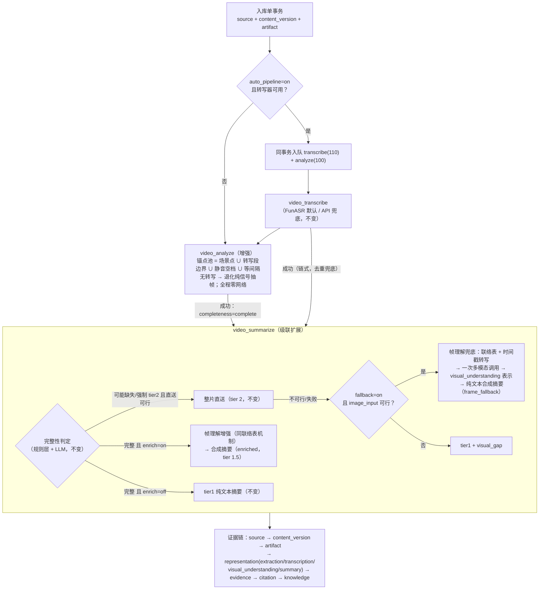

# 源知库 v1.7 需求：转写引导的关键帧分析与帧级画面理解（兜底 + 可选增强）

## 1. 元数据与状态

- 状态：**已并入 `docs/requirements.md` 冻结基线并已完成实现**（2026-09-04：REQ-056/057 新增、REQ-016/017/043/044/051/052/053/055 修订已进入冻结需求文本，代码与测试落地；ADR-012/013 已归档）。残留事项：E5 供应商图像输入官方文档核实归档、E6 联络表成本实测校准、供应商真实联络表调用冒烟（Qwen/MiMo 各一次，独立验收登记）、独立审核报告——见 §10 门禁清单，未完成项不伪装通过。
- 来源：用户 2026-09-04 会话提出的目标流程描述（见 §2.1 原样照录），以及同会话四项拍板：①抽帧策略取「两者组合」（本地语义锚点融合为基础、AI 可用时叠加推荐）；②恢复帧级画面理解；③交付物方案文档先行；④帧理解定位「兜底 + 可选增强」；同日追加审定三项：D-a 帧理解作业形态=摘要作业内分支、D-b 兜底默认 on、D-c 联络表帧数默认 24（§14）。
- 与既有版本关系：v1.5 的本地转写（`REQ-054`）、视频直送（`REQ-055`）、双分组媒体 AI（`REQ-051`/`REQ-052`）与 v1.6.0 加固全部保持不变；本版调整视频管线顺序与关键帧策略，并按新裁定（决策 26）将 2026-08-16 偏差 B「移除关键帧视觉路径」有意识修订为「兜底 + 可选增强」三级级联。下载通道（`REQ-047` 系列）、文档/粘贴解析与分类链路、图片分析（`REQ-048`）均不动。
- 编号：新增 `REQ-056`（转写先行管线与转写引导关键帧分析）、`REQ-057`（帧级画面理解）；修订 `REQ-016`、`REQ-017`、`REQ-043`、`REQ-044`、`REQ-051`、`REQ-052`、`REQ-053`、`REQ-055`。决策编号从既有记录（决策 22 为 2026-08-17 中转 cos 增补）之后续排 23–27（§3/§14）。
- 配套文档：实施计划文档待本文档审定后另行制定。

## 2. 目标与非目标

### 2.1 目标流程（用户描述，原样照录）

> 我认为作业一需要结合语音转写的内容综合分析关键帧，而不是仅仅凭机器识别。请跟我一起梳理这一流程我认为获取关键帧需要对画面进行理解，起码需要进行语音转写再进行分析

### 2.2 目标

- `G1`：管线重排——转写先行。入库单事务同时入队 `video_transcribe` 与 `video_analyze`（转写优先级更高保序），分析作业执行时读取同版本转写表示；转写不可用/失败时分析照跑并退化为现行纯信号抽帧。
- `G2`：本地语义锚点融合——转写段边界、静音空档中点并入关键帧采样计划（与场景切变点、等间隔锚点融合），纯本地零网络；采样来源 `reason` 扩展 `transcript`/`silence`。
- `G3`：联络表帧理解——候选帧缩略图网格（联络表）+ 带时间戳转写文本，一次多模态调用同时产出「值得关注时刻」与带时间戳的画面理解条目（替代「文本 LLM 报时间戳 → 再抽帧 → 再理解」三段式）。
- `G4`：帧理解定位「兜底 + 可选增强」（决策 26，用户裁定）——整片直送仍为主路径；直送不可行/失败时帧理解兜底，`visual_gap` 收窄为「直送与帧理解皆不可行」；另设独立开关允许「转写完整时也做帧理解增强」（默认关）。
- `G5`：全部既有纪律不变——分析作业零网络与断路器（`REQ-015`/`REQ-016`）、附加产物语义（`REQ-033a`）、出站校验与凭据隔离（`REQ-052`）、证据时间定位（`REQ-016`）、错误脱敏（`REQ-017`）、verify-before-persist（`REQ-016`）。

### 2.3 非目标

- 不改下载通道（`REQ-047`）、本地转写引擎（`REQ-054`）、文档/粘贴与图片链路。
- 不引入新 AI 供应商；帧理解复用 `ai_video_provider` 已配置端点与凭据，仅新增供应商图像输入能力声明。
- `video_analyze` 本地纪律不变：全程零网络，LLM 参与只发生在摘要/帧理解作业内（`REQ-015`「视频分析禁止网络」原文继续成立）。
- 不做按模型反馈的迭代选帧（模型请求更细时刻 → 第二轮抽帧）：本版以单次联络表调用为限，迭代选帧列为未来方向（§15）。
- 联络表缩略图与瞬态补抽帧不持久化为 `video_frames`、不落 artifact：持久帧产物仍仅由分析作业产生（决策 27）。
- 不做说话人分离、不做转写增强、不做实时/流式处理。

### 2.4 现状对照

| 环节 | 现状（v1.6.0） | 本版改动 |
| --- | --- | --- |
| 入库首作业 | 仅入队 `video_analyze`（`services/imports.py:181/273` → `create_ingest` 单作业 `job_kind` 参数，`adapters/sqlite.py:754-842`） | 同事务入队转写 + 分析两个作业，转写优先级更高保序（决策 23）；`ai_auto_pipeline=off` 时仅入队分析（语义与现状一致） |
| 关键帧选取 | 场景检测（scene>0.3，`adapters/media.py:34`）+ 等间隔槽位吸附，纯信号级 | 融合转写段边界、静音空档锚点（决策 24）；转写缺失自动退化，行为与现状一致 |
| 帧的消费者 | 仅人工浏览/导出/再导入；**无任何 AI 路径消费帧**（摘要帧级视觉路径已于 v1.5 移除，`services/jobs.py:905` 偏差 B 注释） | 浏览不变；另作联络表素材进入帧理解（`REQ-057`） |
| 补充理解级联 | 两级：整片直送 → `visual_gap`（偏差 B） | 三级：整片直送 → 帧理解兜底 → `visual_gap`（决策 26） |
| 转写完整时的画面理解 | 无（tier1 纯文本摘要） | 可选增强（`ai_video_frames_enrich`，默认关，决策 26） |
| 作业依赖 | 分析成功链式转写、转写成功链式摘要（`services/jobs.py:580-584/830-834`）；转写对分析零依赖（已核实 `services/jobs.py:747` 仅读 artifact 提音轨） | 移除分析→转写链；分析成功链式摘要、转写成功链式摘要保留（`_chained_child_if_due` 去重兜住双触发） |
| 转写晚到后的重分析 | 无手动分析入口（仅 transcribe/summarize 手动端点，`main.py:1022-1046`） | 新增 `POST /videos/{id}/analyze` 手动重分析（§6.1） |

### 2.5 目标流程图

```
入库事务（单事务）：source + content_version + artifact
  └─ auto_pipeline=on 且转写器可用 → 同事务入队 video_transcribe(priority 110)
                                       + video_analyze(priority 100)
     （单 worker 串行 + priority DESC 排序 → 转写必然先执行）
          │
          ▼
 作业 video_transcribe（现行逻辑不变：FunASR 默认 / API 兜底）
          │ transcription 表示落库（video_time_range 逐段证据）
          ▼
 作业 video_analyze（增强）：
   读取同版本 transcription 表示
   → 锚点池 = 场景切变点(scene>0.3) ∪ 转写段边界 ∪ 静音空档中点 ∪ 等间隔锚点
   → 槽位吸附、去重、≤max_frames → 每帧独立 artifact + reason(scene/even/transcript/silence)
   （无转写表示 → 退化为现行纯信号抽帧，作业消息注明；分析全程零网络）
          │ 成功：completeness=complete（ready 唯一写点）
          │ auto_pipeline=on 且理解组可用 → 链式 video_summarize
          ▼
 作业 video_summarize（级联扩展）：
   完整性判定（规则层 + LLM，不变）
   ├─ want_direct 且直送可行 → 整片直送（tier 2，不变）
   │    └─ 直送不可行/失败 且 ai_video_frames_fallback=on 且 image_input 可行
   │         → 帧理解兜底：联络表 + 时间戳转写 → 一次多模态调用
   │           → visual_understanding 表示（逐条 video_time_range 证据）
   │           → 纯文本合成摘要（标记 frame_fallback）
   ├─ !want_direct 且 ai_video_frames_enrich=on → 帧理解增强（同联络表机制，
   │    标记 enriched，tier 1.5）
   └─ 皆不可行 → tier1 纯文本摘要 + visual_gap（语义收窄）
```

Mermaid 版：



## 3. 选型记录

- **决策 23（管线顺序：入库双入队 + 优先级保序）**。`create_ingest` 扩展为支持同事务入队两个作业：`ai_auto_pipeline=on` 且转写器可用（本地模型已下载或转写 API 已配置，同 `REQ-051` 链式门控口径，`services/jobs.py:674-679`）时入队 `video_transcribe`（priority 110）+ `video_analyze`（priority 100）——作业领取按 `priority DESC, created_at ASC`（`adapters/sqlite.py:1448-1480`）加单 worker 串行，priority 差保证转写先执行，不依赖 created_at 时间戳精度；`ai_auto_pipeline=off` 或转写器不可用时仅入队分析（前者保持「分析自动、转写手动」的 v1.6 语义，后者保持「无转写则纯信号分析」的退化路径）。移除既有「分析成功链式转写」（`services/jobs.py:580-584`）；分析成功与转写成功均链式摘要，`_chained_child_if_due`（`services/jobs.py:621-632`）按 version+kind 去重兜住双触发，无新机制。
- **决策 24（本地语义锚点融合，纯本地）**。抽帧锚点池 = 场景切变点（scene>0.3 既有）∪ 转写段起点/终点 ∪ 静音空档中点（长静音区为画面切换高发段，且是「语音里没有的画面信息」的唯一本地线索）∪ 等间隔锚点；槽位吸附从「最近场景点否则 even」（`adapters/media.py:39-84`）扩展为 scene > transcript/silence > even 三级优先；去重、黑帧护栏、`video_max_frames` 封顶、5%–95% 锚点纪律全部不变。`reason` 列为自由 TEXT（`adapters/sqlite.py:70`，默认 `even`），新增枚举值零迁移。**分析身份纳入转写引导来源**：`config_hash` 输入追加同版本 transcription 表示的 `config_hash`（无转写时以 `none` 参与）——否则「同名分析、不同帧」会触发 `persist_video_analysis` 同键内容不一致抛错（`adapters/sqlite.py:874-875`）；转写晚到/换引擎后的重分析构成新分析身份、按既有多分析并存纪律保留，detail 取最新（`adapters/sqlite.py:907-916`）。
- **决策 25（联络表单次调用）**。候选 = 当前分析的持久帧 + 按锚点池补抽的瞬态缩略图（摘要作业 staging 内 ffmpeg 提取，≤`ai_video_sheet_frames` 格、单格缩放 ≤320px 宽），网格拼接为单图，随附带时间戳的转写文本，一次多模态调用（复用 `ai_video_provider` 端点/凭据）同时产出：①值得关注时刻清单（含依据）②带时间戳的画面理解条目。相比「文本 LLM 报时间戳→再抽帧→再理解」三段式少一次往返，且时刻选择有画面依据而非纯文本推测。瞬态缩略图作业结束即清理，绝不入 `video_frames`/artifact（帧产物 = 分析作业专属，verify-before-persist 纪律不受影响）。
- **决策 26（帧理解定位：兜底 + 可选增强；2026-09-04 用户裁定，对偏差 B 的有意识修订）**。补充理解级联从两级改三级：①整片直送（维持主路径——稀疏帧丢运动与帧间文字，信息量严格劣于整片）；②帧理解兜底（`ai_video_frames_fallback`，推荐默认 on：仅在用户已授权 AI 的直送场景触发、数据量远小于直送，随直送组授权）；③`visual_gap`（两者皆不可行才标记）。另设增强 `ai_video_frames_enrich`（默认 off）：转写完整（tier1 场景）时也做帧理解，摘要合成转写 + 画面条目（tier 1.5）。**修订理由**：v1.5 发布后实践暴露直送不可行场景（MiMo base64 ≈37MB 原始上限、未配中转、分块失败）只能 `visual_gap`；帧数据量小、任何已配置 AI 环境可达。本裁定取代 2026-08-16 偏差 B「彻底移除关键帧视觉路径」的「彻底」部分——帧理解作为兜底与增强回归，直送主路径地位不变。
- **决策 27（作业形态与证据形态，2026-09-04 用户审定确认）**。作业形态：帧理解实现为**摘要作业内分支**（审定确认），而非独立作业 + 「转写与分析两父汇合」链式机制——兜底/增强的触发条件（直送是否失败、完整性判定结果）只在摘要作业运行中可知，独立作业要么 Always-on 产生无谓调用、要么无法预知触发；分支式零新增作业 kind、零新增租约/心跳/链式接线，`REQ-033a` 语义自然覆盖（摘要本就是附加产物）。备选（独立作业 + 复用 `_chained_child_if_due` 扩展前置条件检查）经审定否决、留档备查。证据形态：帧理解条目落独立 representation（`kind="visual_understanding"`，`kind` 列为自由 TEXT 无 CHECK 约束，`adapters/sqlite.py:78`，零迁移），父链挂 transcription 表示，逐条 `video_time_range` 证据（模型未给时间定位的条目以联络表对应窗格时间范围定位）；进入全文检索（与 transcription/summary 同口径，`services/search.py:89-93` 仅排除 `ffmpeg-local` extraction）。

## 4. 需求文本

### 4.1 REQ-016 修订（在既有文本末尾追加）

> ……分析身份 `config_hash` 输入另含同版本 transcription 表示的 `config_hash`（无转写时以 `none` 参与，`REQ-056.3`）；转写引导状态变化构成新分析身份，多份分析按既有幂等键并存、detail 取最新，同键内容不一致仍抛错（verify-before-persist 不变）。

### 4.2 REQ-017 修订（摘要侧一句替换）

> 摘要侧在完整性判定后按 `REQ-055` 三级补充理解执行（用户裁定 2026-08-16：直送三合一；用户裁定 2026-09-04 修订偏差 B：新增帧理解兜底与可选增强，见 `REQ-057`；直送与帧理解皆不可行则 tier1 摘要 + visual_gap）。

### 4.3 REQ-051 修订（自动串联两句替换）

> ……`ai_auto_pipeline` 总开关（默认开，经 `PUT /settings/ai` 调整）：开启且任一转写路径可用时，入库单事务同队转写与分析（转写优先级更高，`REQ-056.1`）；开启但转写器不可用、或开关关闭时，仅入队分析（开关关闭即保持「分析自动、转写手动」的既有语义）；分析成功自动串联摘要（`ai_auto_pipeline` 且理解组可用），转写成功亦链式摘要（去重兜底）。文档/粘贴解析成功自动入队 `source_classify` 作业（其余不变）……

### 4.4 REQ-052 修订（出站枚举一句扩展）

> ……音频分块、转写文本、联络表帧图片与瞬态补抽缩略图（`REQ-057`，随摘要作业发往所配置视频端点）与视频直送的视频字节流（`REQ-055`，含供应商临时上传主机与自备中转地址——同样仅 HTTPS/公网主机/无 userinfo 校验）在用户逐视频显式触发或 `ai_auto_pipeline` 自动串联时发往所配置端点……

### 4.5 REQ-053 修订（锚点池与 reason）

> 关键帧采样为场景感知混合策略，v1.7 起锚点池扩展为：ffmpeg 场景检测（阈值 0.3）候选点 ∪ 转写段起点/终点 ∪ 静音空档中点（锚点仅取自同版本 transcription 表示，`REQ-056.2`）∪ 等间隔槽位；槽位在半个槽距容差内按 scene > transcript/silence > even 优先级吸附最近未使用锚点，吸不到保留等间隔位置；首末槽锚定约 5%/95%，短视频（<120s）至少 3 帧，长视频按 120 秒密度并受 video_max_frames 封顶；黑帧（灰度均值 <16）拒绝并按候选序列（未使用锚点、±5% 平移）重试；每帧持久化采样来源 reason（scene/even/transcript/silence，零 schema 迁移）与采样参数（随分析元数据），帧宽高为真实像素值。

### 4.6 REQ-055 修订（第 2 条级联替换）

> 2. 三级补充理解（决策 26，用户裁定 2026-09-04 修订偏差 B）：① 视频直送（主路径，机制不变——`ai_video_provider` 非 off 且能力声明可行时整片直送/分块直送，多模态一次性产出三合一）；② 帧理解兜底——直送不可行（未配置、能力不可行、超上限、调用失败）且 `ai_video_frames_fallback=on` 且供应商适配器声明 `image_input` 可行时，按 `REQ-057` 联络表机制执行帧理解，成功后摘要由纯文本模型合成转写 + 画面条目（标记 frame_fallback）；③ `visual_gap`——直送与帧理解皆不可行/失败时，摘要仍由纯文本模型按 tier1 产出并标记 visual_gap。任何情况下不伪造补充内容。

### 4.7 REQ-043 / REQ-044 修订

> `REQ-043`：……新增 `POST /videos/{id}/analyze`（手动重分析，无前置条件，幂等由分析身份去重，§6.1）；`/settings/ai` 扩展帧理解配置（§6.2）；`/capabilities` 的 `media.ai.video_input` 增加 `image_input` 能力声明（§6.3）；类型稳定并有 OpenAPI。
>
> `REQ-044`：设置页「媒体 AI」视频直送区扩展帧理解配置（兜底开关、增强开关、联络表帧数上限）；视频详情页展示画面理解条目（`visual_understanding` 表示，`[mm:ss]` 时间定位）与摘要标记（`frame_fallback`/`enriched`），并提供「重新分析」入口（转写晚到后获取引导帧）；其余页面与极简中文纪律不变。

### 4.8 新增 REQ-056（转写先行管线与转写引导关键帧分析，6 条）

1. 入库单事务（本地导入 `services/imports.py:152-182` 与链接下载 `services/imports.py:216-294` 同路径）的入队矩阵：`ai_auto_pipeline=on` 且转写器可用 → 同事务入队 `video_transcribe`（priority 110）与 `video_analyze`（priority 100），priority 差 + 单 worker 串行保证转写先执行；`ai_auto_pipeline=off` 或转写器不可用 → 仅入队 `video_analyze`（前者保持 v1.6「分析自动、转写手动」语义，后者保持退化路径）。移除既有「分析成功链式转写」。
2. `video_analyze` 执行时若同版本已存在 transcription 表示，则抽帧计划按 `REQ-053` 修订融合转写锚点；无转写表示（未跑/失败/blocked）时退化为现行纯信号抽帧，作业消息注明「转写不可用，按场景感知策略抽帧」，不阻塞不失败。分析作业全程保持零网络（`REQ-015` 纪律不变，负向测试断言）。
3. 分析身份（`config_hash`）输入含采样参数（既有）+ 同版本 transcription 表示的 `config_hash`（无转写以 `none` 参与）；转写引导状态变化（无→有、换引擎/模型）构成新分析身份，多份分析按 `(version, analyzer, config_hash)` 幂等并存、detail 取最新；同键内容不一致仍抛错。
4. 转写晚到（分析先完成）后，用户可经 `POST /videos/{id}/analyze` 手动重分析获得转写引导帧；旧分析、旧帧与帧 artifact 保留（既有多分析并存纪律），既有引用不受影响。
5. 分析成功仍为来源 ready（completeness=complete / processing=succeeded）唯一写点，与执行顺序无关（`REQ-033a`）；转写、摘要、帧理解失败或取消不降低版本与来源状态。
6. 帧的持久化产物仍仅由分析作业产生（每帧独立 artifact + `video_frames` 行，reason 扩展 scene/even/transcript/silence）；摘要作业的联络表缩略图与瞬态补抽不入 `video_frames`、不落 artifact、作业结束即清理（`REQ-057.1`）。

### 4.9 新增 REQ-057（帧级画面理解：联络表 + 兜底 + 可选增强，6 条）

1. 机制（决策 25）：摘要作业内构建联络表——候选 = 当前分析的持久帧 + 按锚点池补抽的瞬态缩略图（摘要作业 staging 内 ffmpeg 提取，≤`ai_video_sheet_frames` 格、单格缩放 ≤320px 宽），网格拼为单图，随附带时间戳的转写文本，一次多模态调用（复用 `ai_video_provider` 端点与凭据）产出：①值得关注时刻清单（含依据）②带时间戳的画面理解条目（画面描述 + 可选画面文字）。模型无有效输出按失败处理，绝不伪造。
2. 兜底触发（`ai_video_frames_fallback`，默认 on，2026-09-04 审定）：`REQ-055.2` 直送判定不可行/失败，且适配器 `capability().image_input` 可行时执行；成功 → 摘要由纯文本模型合成转写 + 画面条目（标记 frame_fallback，tier 2）；失败/不可行 → tier1 + visual_gap（语义收窄为「直送与帧理解皆不可行」）。
3. 增强触发（`ai_video_frames_enrich`，默认 off）：完整性判定为内容完整且开关开启时执行帧理解，摘要合成转写 + 画面条目（标记 enriched，tier 1.5）；开关关闭或帧理解不可行时行为与 v1.6 tier1 完全一致。
4. 证据与表示（决策 27）：条目落独立 representation（`kind="visual_understanding"`，父链挂 transcription 表示），逐条 `video_time_range` 证据（模型未给时间定位时以联络表对应窗格时间范围定位）；`config_hash` 含供应商/模型/联络表参数/提示词版本；进入全文检索（与 transcription/summary 同口径）。
5. 出站与凭据：联络表图片与瞬态缩略图仅发往用户显式配置的媒体 AI 端点（`REQ-052` 纪律全覆盖）；瞬态文件不入 artifact/备份/导出/日志；错误脱敏；响应原文不落库不落日志。
6. 供应商能力声明：适配器 `capability()` 增加 `image_input`（E5 核实后写入）；能力不可行时兜底按不可行处理（→ visual_gap）、增强跳过并在作业消息注明，绝不静默换端点或伪造画面条目。

## 5. 威胁模型修订（新增行）

| 威胁 | 缓解 | REQ |
| --- | --- | --- |
| 画面帧经联络表外泄 | 仅发往用户显式配置的媒体 AI 端点；仅在摘要作业内、且仅当用户已触发直送（兜底）或显式开启增强时发生；帧数据量远小于整片直送；瞬态文件不入 artifact/备份/导出/日志；错误脱敏 | REQ-057, REQ-052 |
| 转写锚点与视频版本错配 | 锚点仅取自同版本 transcription 表示；分析身份纳入转写来源 `config_hash`，跨版本/跨引擎不共用分析身份 | REQ-056 |
| 联络表超限调用被拒或成本失控 | `ai_video_sheet_frames` 上限（默认 24）；供应商图像限制以能力声明为准；超限按上限截断网格并在作业消息注明（不静默） | REQ-057 |
| 转写引导抽帧被误当作「理解」 | 分析作业零网络纪律不变（负向断言）；帧理解条目独立表示 + 逐条时间定位证据，与分析帧（浏览用途）可区分 | REQ-056, REQ-057 |

## 6. API 契约

### 6.1 端点

- `GET/PUT /settings/ai`：扩展（§6.2 字段表）。
- `POST /videos/{id}/analyze`：新增——手动重分析，创建 `video_analyze` 作业（随机 ID、priority 100）；无前置条件（与 transcribe/summarize 手动端点同口径，`main.py:1022-1046`）；幂等由分析身份去重，同参数重复触发由 `persist_video_analysis` 幂等键吸收。
- `/capabilities`：`media.ai` 扩展（§6.3）。
- 其余端点不变；`GET /videos/{id}` 响应结构不变（画面理解条目经既有 representations 接口承载）。

### 6.2 设置字段表（`PUT /settings/ai` 扩展）

| 字段 | 类型 | 默认 | 校验 | 说明 |
| --- | --- | --- | --- | --- |
| `ai_video_frames_fallback` | enum | `on` | `on\|off` | 直送不可行时帧理解兜底（REQ-057.2） |
| `ai_video_frames_enrich` | enum | `off` | `on\|off` | 转写完整时帧理解增强（REQ-057.3） |
| `ai_video_sheet_frames` | int | `24`（E6 实测可调） | 8–48 | 联络表缩略图上限（决策 25） |

- `GET /settings/ai` 的 `video_input` 节扩展：`{..., image_input, frames_fallback, frames_enrich, sheet_frames}`。

### 6.3 capabilities 扩展

- `media.ai.video_input` 增加 `image_input: bool`（供应商图像输入能力声明，E5 核实后写入适配器）。

### 6.4 错误码表

- 不新增错误码：帧理解可达性问题均在作业层表达（blocked/failed + 脱敏作业消息），与转写/直送同口径。

### 6.5 OpenAPI 影响

- `domain/models.py`：`AiSettingsUpdate` 扩展 §6.2 三字段（枚举与范围校验）。OpenAPI 自动生成（`REQ-043`）。

## 7. 接口设计

### 7.1 入库双入队（`backend/app/adapters/sqlite.py` + `backend/app/services/imports.py`）

- `create_ingest` 的 `job_kind: str` 参数扩展为支持第二作业（如 `extra_job: tuple[str, int] | None`），同事务插入两行作业；`imports.video` 与 `imports.downloaded_video` 按 §4.8.1 矩阵传参（转写器可用性检查经组装根注入，`main.py:86-171`）。

### 7.2 作业链序改造（`backend/app/services/jobs.py`）

- 移除 `_video_analyze` 成功路径的链式 `video_transcribe`（`jobs.py:580-584`）；新增链式 `video_summarize`（门控 `ai_auto_pipeline` + understand_enabled，同现 830-834 口径）；`_video_transcribe` 成功链式 `video_summarize` 保留——双链由 `_chained_child_if_due` 去重。
- `_video_download` 成功消息文案「已排入本地视频分析」→「已排入语音转写与本地分析」。

### 7.3 锚点融合（`backend/app/services/videos.py` + `backend/app/adapters/media.py`）

- `VideoService.analyze` 新增可选入参：同版本 transcription 表示（段级时间范围列表 + 其 `config_hash`）；无则按现行路径。
- `plan_frame_times`（`media.py:39-84`）扩展：接受 `transcript_anchors: list[tuple[int,int]]`，派生段边界与静音空档中点（静音空档计算复用摘要作业同口径，`jobs.py:869-885`）；槽位吸附三级优先（scene > transcript/silence > even）；帧 `reason` 写入扩展值。
- 分析身份 `config_hash` 输入追加转写来源（§4.8.3）。

### 7.4 联络表构建与调用（`backend/app/adapters/video_ai.py` + `backend/app/ports/media.py`）

- `VideoUnderstandingPort` 扩展 `understand_frames(sheet_image: Path, transcript_text: str, sheet_times: list[tuple[int,int]], cancelled) -> dict`：输入网格图 + 窗格时间范围表 + 带时间戳转写，输出时刻清单 + 理解条目；`capability()` 增加 `image_input`。
- Qwen/MiMo 适配器各实现图像输入分支（E5 核实后定参数）；错误经 `sanitize_ai_error` 脱敏（`media_ai.py:50-69` 同口径）。

### 7.5 摘要作业三分支（`backend/app/services/jobs.py` `_video_summarize`）

- 既有 `want_direct` 判定后：直送失败/不可行 → 读 `ai_video_frames_fallback` 与 `image_input` → 联络表兜底；`!want_direct` → 读 `ai_video_frames_enrich` → 增强帧理解。`visual_gap = want_direct and not video_direct and not frame_fallback`（现 `jobs.py:932` 收窄）。
- 摘要正文标记扩展：`frame_fallback`/`enriched` 写入隐藏标记行（`jobs.py:161-210` 口径），前端解析展示。
- 条目持久化：`persist_representation_bundle(kind="visual_understanding", parent=transcription 表示 ID)`（`sqlite.py:1014-1164` 既有机制，幂等键 + 派生证据自动生成）。

### 7.6 手动重分析端点（`backend/app/main.py`）

- `POST /videos/{id}/analyze`：校验 detail 存在（同 transcribe/summarize 口径）→ 创建 `video_analyze` 作业 → 202。

### 7.7 前端改动点（`frontend/src/App.tsx`）

- 设置页：视频直送区扩展三个帧理解字段（§6.2）。
- 视频详情页：画面理解条目区块（`visual_understanding` 表示渲染，`[mm:ss]` 定位）；摘要标记 `frame_fallback`/`enriched` 展示；「重新分析」按钮（`POST /videos/{id}/analyze`）。
- 作业页无新 kind（帧理解在摘要作业内），无需改动。

## 8. 测试计划

- `T-ANCH-001`（单元）：锚点融合——场景点 ∪ 转写段边界 ∪ 静音空档中点 ∪ 等间隔的三级吸附、去重、max_frames 封顶、黑帧护栏；reason 写入 scene/even/transcript/silence；config_hash 随转写来源变化（无/有/换引擎 → 三种身份）；无转写退化路径作业消息。
- `T-REORDER-001`（单元 + 集成）：双入队矩阵（auto on/off × 转写器可用/不可用）；priority 保序断言（转写先执行）；分析→摘要链、转写→摘要链双触发去重；下载/导入完成消息文案；分析成功 ready 写点与顺序无关；`REQ-033a` 回归。
- `T-FRAME-001`（单元，fake 适配器）：兜底触发矩阵（直送成功/不可行 × fallback on/off × image_input 有/无）；增强触发矩阵（enrich on/off × 完整性判定）；联络表构建（持久帧 + 瞬态补抽、≤sheet_frames 截断并注明、staging 清理、瞬态帧不入 video_frames/artifact 断言）；条目逐条 video_time_range 证据与独立表示（parent=transcription）；visual_gap 收窄断言。
- `T-FRAME-002`（集成，fake 全链路）：导入/下载 → 双入队 → 转写 → 分析（转写引导帧）→ 摘要（兜底/增强支路）→ 证据链完整；转写晚到 → 手动重分析 → 新分析身份并存、detail 取最新。
- 顺序钉子改造：`tests/unit/test_media_ai.py:551-576`（链序断言改为「双入队 + 分析链摘要」）、`tests/integration/test_local_full_chain.py:193-240`、`tests/unit/test_job_idempotency.py:153-174`、`test_job_atomic_commits.py`、以 `video_analyze` 成功为前置的用例（`test_video_direct.py:382-410`、`test_local_stt.py:289-361`、`test_media_ai.py:106`）适配新序。
- 纪律回归：分析路径零网络负向断言；出站校验；错误脱敏；瞬态帧不入备份/导出（归档白名单断言）。
- 前端冒烟：设置页三字段往返；详情页画面理解条目与标记；重新分析按钮。
- 供应商真实调用冒烟（独立验收，不作为自动化门禁）：Qwen 与 MiMo 联络表帧理解各一次真实调用，脱敏摘要登记。

## 9. 验收矩阵新增条目（沿用 `docs/acceptance-matrix.md` 格式）

| 需求组 | 实现证据 | 自测标识 | 独立复核重点 |
|---|---|---|---|
| REQ-056, REQ-016/051/053(修订) | `adapters/sqlite.py`, `services/imports.py`, `services/videos.py`, `adapters/media.py`, `services/jobs.py`, `main.py` | T-ANCH-001, T-REORDER-001 | 双入队保序与退化；分析零网络；分析身份含转写来源；多分析并存与重分析；ready 写点语义 |
| REQ-057, REQ-017/043/044/052/055(修订) | `services/jobs.py`, `adapters/video_ai.py`, `ports/media.py`, `domain/models.py`, `main.py`, `frontend/src/App.tsx` | T-FRAME-001, T-FRAME-002 | 三级级联不伪造；兜底/增强触发矩阵；逐条时间定位证据；瞬态帧不持久化；出站纪律；visual_gap 收窄 |

## 10. 审核与门禁流程

- 四角色分离沿用既有流程（development → testing → acceptance → review），报告按 `report-schema-v1.json` 归档。
- 冻结门禁清单（全部满足才允许冻结为 v1.7）：
  1. 本文档经用户审定（已完成：2026-09-04 决策 27 作业形态与两个默认值确认）；
  2. T-ANCH-001、T-REORDER-001、T-FRAME-001、T-FRAME-002 通过；
  3. 顺序钉子测试改造完成，全量回归不劣化（489+ 项基线）；
  4. 分析路径零网络负向断言通过；
  5. E5 供应商图像输入能力核实结论归档进本文档；
  6. 供应商真实联络表调用冒烟完成（Qwen + MiMo 各一次，脱敏摘要，失败如实登记）；
  7. 出站负向验证（帧图片仅发往已配置端点；未配置端点零流量）；
  8. 独立审核报告已出具且阻断项已解决、主要项已裁决。

## 11. 实施任务分解（概览；详见 `docs/v1-7-implementation-plan.md`）

| 步骤 | 内容 | 门禁 |
|---|---|---|
| 1 | `create_ingest` 双入队 + 入队矩阵 + 链序改造 + 下载文案 | T-REORDER-001 |
| 2 | 锚点融合 + reason 扩展 + 分析身份扩展 | T-ANCH-001 |
| 3 | 联络表端口/适配器 + 摘要三分支 + visual_understanding 落库 | T-FRAME-001 |
| 4 | 手动重分析端点 + 设置/capabilities + 前端 | T-FRAME-002 + 前端冒烟 |
| 5 | 文档冻结（§13 清单）+ ADR-012/013 | REQ 编号与实现 file:line 交叉核对 |

## 12. 回滚与兼容

- 新设置默认值下行为：`ai_video_frames_enrich=off` → tier1 场景与 v1.6 完全一致；`ai_video_frames_fallback=on` 仅在直送已失败的路径生效——直送成功路径零变化，原本直接 `visual_gap` 的场景变为兜底结果（属预期行为改进，如需完全回退置 off）。
- 管线重排为结构性变化，不可经设置回退：代码回退即回 v1.6 行为；对既有已完成视频无影响（不自动重跑）。
- 既有分析/帧/表示兼容：新 `reason` 值与新 `kind` 仅影响新作业；旧表示照常展示与检索；零 schema 迁移（`kind`/`reason` 均自由 TEXT）。
- 重分析产生新分析身份并存，current=最新；旧帧与帧 artifact 保留，既有引用不受影响。
- `config_hash` 输入扩展仅影响新分析身份；既有分析行不迁移。

## 13. 文档同步清单（冻结时逐文件更新）

- `docs/requirements.md`：REQ-016/017/043/044/051/052/053/055 替换为第 4 章修订文本；新增 REQ-056（6 条）/REQ-057（6 条）。
- `docs/decisions/ADR-012-transcript-guided-frame-sampling.md`：决策 23/24 正式记录；`ADR-013-frame-understanding-fallback.md`：决策 25/26/27 正式记录（ADR-006/ADR-011 标记部分取代）。
- `docs/threat-model.md`：表尾追加第 5 章 4 行。
- `docs/api-contract.md`：settings 字段、`POST /videos/{id}/analyze`、capabilities 扩展。
- `docs/acceptance-matrix.md`：追加第 9 章两行。
- `docs/test-plan.md`：追加 T-ANCH-001、T-REORDER-001、T-FRAME-001/002 与顺序钉子改造说明。
- `docs/operations-and-recovery.md`：帧理解兜底/增强运维语义；重分析入口；日志纪律不变。
- `docs/user-guide/index.html`：视频处理流程说明与设置页新字段说明。
- 本文档状态更新为「已并入冻结基线并已完成实现」。

## 14. 决策记录

已拍板（2026-09-04，用户会话确认）：

1. **抽帧策略「两者组合」**：本地语义锚点融合为基础（决策 24），AI 可用时叠加推荐（决策 25 联络表机制承载）。
2. **恢复帧级画面理解**（决策 26），定位「兜底 + 可选增强」——对 2026-08-16 偏差 B 的有意识修订，直送主路径地位不变。
3. **交付物方案文档先行**：本文档即为交付物，审定后再实施。
4. **管线重排 + 联络表单次调用**（决策 23/25）。

追加拍板（2026-09-04 同日审定）：

5. **帧理解作业形态：摘要作业内分支**（决策 27，用户审定 D-a）；备选「独立作业 + 两父汇合」经审定否决留档——无法预知直送失败，Always-on 则每视频多一次调用。
6. **兜底开关默认 `on`**（用户审定 D-b）：仅在用户已授权 AI 的直送失败场景触发，帧数据量远小于直送。
7. **联络表帧数默认 `24`**（用户审定 D-c）：12 持久帧 + 12 补抽；E6 实测后可调。

待审定项：无——原 D-a/D-b/D-c 已于 2026-09-04 全部裁定。

## 15. 遗留、风险与自述假设

遗留与实测项：

- **E5（供应商图像输入能力核实）**：qwen-vl 系列单请求图片数量/分辨率/大小限制；mimo-v2.5 图像输入支持与上限——实施期以官方文档核实，写入适配器能力声明与本文档 §3。
- **E6（联络表成本实测）**：单图格数 × 单格分辨率 × token 成本平衡；默认 24 为初始值，实测后归档调整。
- **迭代选帧为未来方向**：模型在联络表调用中请求更细时刻 → 第二轮抽帧 → 二次调用；本版单次调用为限。

风险：

- **帧理解条目时间戳精度依赖模型标注**：模型不给时间定位时以联络表窗格时间范围定位（条目粒度 = 窗格间隔，最长可达视频时长/格数）；文档在 UI 层展示定位精度来源。
- **稀疏帧固有信息损失**：兜底/增强产出劣于整片直送，摘要标记明示产出方式（frame_fallback/enriched），不与直送产出混淆。
- **顺序钉子测试改造面较大**：以 `video_analyze` 成功为前置的既有用例需适配；改造期可能暴露隐藏顺序假设，按发现即修处理。

自述假设（供测试/审核核对，非结论）：

1. 本文档 `file:line` 引用以 2026-09-04 工作区代码（master，发布 v1.6.0 后）为基准核实；实施期以当时代码为准。
2. `representations.kind` 与 `video_frames.reason` 为自由 TEXT、无 CHECK 约束（`adapters/sqlite.py:70/78`），新增枚举值零迁移——已核实。
3. 双入队保序依赖 priority 差（110/100）而非 created_at 精度；`claim_next_job` 排序键 `priority DESC, created_at ASC`（`adapters/sqlite.py:1448-1480`）——已核实。
4. 摘要作业静音空档计算（`jobs.py:869-885`）与锚点融合共用同一口径，不重复实现。
5. 帧理解增强（tier 1.5）不改变完整性判定与 `REQ-033a` 语义；摘要建议分类仍按 `REQ-051` 只填空缺。
6. 转写器可用性检查在入库时点取值（本地模型已下载或转写 API 已配置）；入库后用户下载模型不影响已入队作业，可用手动转写补齐。

## 修订记录

- 2026-09-04（初稿，规划阶段）：
  - 按用户目标流程描述建立 v1.7 需求草案（§2.1 原样照录）；四项拍板记录（§1/§14）。
  - 双轮代码核查（管线依赖、状态机、链式机制、帧消费面、测试钉子）形成 §2.4 现状对照。
  - 决策 23–27 落地；发现并采纳「帧理解 = 摘要作业内分支」的简化（决策 27，消除两父汇合新机制）；识别并纳入「分析身份纳入转写来源」约束（决策 24，防同键内容不一致抛错）与「手动重分析端点」缺口（§6.1）。
  - 按 v1-5 规格体例成稿（API 契约/接口设计/测试计划/门禁/回滚/同步清单/决策记录/假设）；待用户审定（D-a/D-b/D-c）。

- 2026-09-04（用户审定，同日）：
  - D-a/D-b/D-c 三项拍板：摘要作业内分支（决策 27 确认）、`ai_video_frames_fallback=on`、`ai_video_sheet_frames=24`。
  - 文档状态 DRAFT → 已审定；配套 `docs/v1-7-implementation-plan.md` 制定。

- 2026-09-04（实现完成，随 v1.7.0）：
  - 实现落地（四阶段提交：双入队与链序、锚点融合、联络表三分支、手动重分析与前端）；决策 23 实现期精化——分析成功时「无转写表示且转写器可用」补链转写（入库矩阵未命中的晚配置场景），有转写表示时链式摘要，避免摘要先行终态失败；转写/分析双入队与补链经 `_chained_child_if_due` 去重。
  - 发现并修复设置键缺失：新设置项须进入 schema 默认种子（sqlite/postgres），否则 `update_settings` 的 UPDATE 语义无法写入新键（T-FRAME-001 首轮暴露）。
  - 基线并入冻结需求（REQ-056/057 新增、八项修订）、威胁模型 4 行、api-contract/acceptance-matrix/test-plan/operations/user-guide 同步；ADR-012/013 归档。
